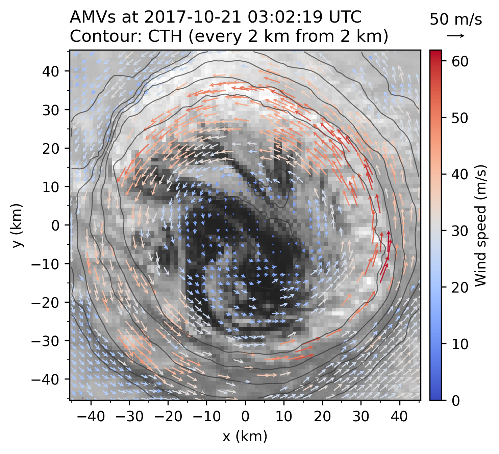

# openTCAMV: sample data & code
This document explains how to use the provided scripts using a sample dataset. To follow the instructions in this document, please change the current directory to the sample directory:
```bash
$ cd openTCAMV/sample
```

Thi document follows the [Tsukada et al. (2024)](https://doi.org/10.1029/2023JD040585) method to conduct cloud tracking for the sample data of Typhoon Lan (2017). Almost settings are the same as the original paper.

## Data
[](https://github.com/tsukada-cs/openTCAMV/releases)  
The sample data is available on the "Release" page of the openTCAMV GitHub repository. Please download the sample data from the following link:

> https://github.com/tsukada-cs/openTCAMV/releases/download/1.0.0/2017_Lan_aeqd_sample.nc

or

```bash
$ wget https://github.com/tsukada-cs/openTCAMV/releases/download/1.0.0/2017_Lan_aeqd_sample.nc
```
Please make sure that the sample date is located at `openTCAMV/sample/2017_Lan_aeqd_sample.nc`. 

This dataset contains satellite imagery of Typhoon Lan (2017) over a 2-hour period starting from 2017-10-21 01:59:48 UTC, at approximately (131.6°E, 21.8°N). For details of this storm, see [Figure 12 of Tsukada et al. (2024)](https://agupubs.onlinelibrary.wiley.com/cms/asset/4b9fb874-75a8-4fc3-9094-685dd073e121/jgrd59466-fig-0012-m.jpg).


The `ncdump -h` command shows the following file structure:
```bash
$ ncdump -h 2017_Lan_aeqd_sample.nc
# ==> netcdf \2017_Lan_aeqd_sample {
# dimensions:
#         t = 50 ;
#         y = 601 ;
#         x = 601 ;
# variables:
#         double clon(t) ;
#                 clon:_FillValue = NaN ;
#                 clon:standard_name = "clon" ;
#                 clon:long_name = "central longitude" ;
#                 clon:units = "degrees_east" ;
#         double clat(t) ;
#                 clat:_FillValue = NaN ;
#                 clat:standard_name = "clat" ;
#                 clat:long_name = "central latitude" ;
#                 clat:units = "degrees_north" ;
#         float B03(t, y, x) ;
#                 B03:_FillValue = NaNf ;
#                 B03:standard_name = "B03" ;
#                 B03:long_name = "toa_bidirectional_reflectance" ;
#                 B03:units = "%" ;
#         float B13(t, y, x) ;
#                 B13:_FillValue = NaNf ;
#                 B13:standard_name = "B13" ;
#                 B13:long_name = "toa_brightness_temperature" ;
#                 B13:units = "K" ;
#         float B14(t, y, x) ;
#                 B14:_FillValue = NaNf ;
#                 B14:standard_name = "B14" ;
#                 B14:long_name = "toa_brightness_temperature" ;
#                 B14:units = "K" ;
#         float cth(t, y, x) ;
#                 cth:_FillValue = NaNf ;
#                 cth:standard_name = "cth" ;
#                 cth:long_name = "cloud top height" ;
#                 cth:units = "km" ;
#         int64 t(t) ;
#                 t:units = "seconds since 2017-10-20T22:32:19" ;
#                 t:calendar = "proleptic_gregorian" ;
#         double x(x) ;
#                 x:_FillValue = NaN ;
#                 x:standard_name = "x" ;
#                 x:long_name = "x from TC center" ;
#                 x:units = "km" ;
#         double y(y) ;
#                 y:_FillValue = NaN ;
#                 y:standard_name = "y" ;
#                 y:long_name = "y from TC center" ;
#                 y:units = "km" ;
# 
# // global attributes:
#                 :season = 2017LL ;
#                 :name = "Lan" ;
# }
```

## 1: Conduct cloud tracking
The cloud tracking script is located at `openTCAMV/scripts/10_conduct_tracking.py`. This script perform cloud tracking for a NetCDF data like the provided sample data.

### 1-1: Tracking without rotation
Following is an example of how to use this script to conduct cloud tracking for the sample data.
```bash
# 1-1 Conduct tracking without rotation
$ revrot=0.0000
$ python ../scripts/10_conduct_tracking.py 2017_Lan_aeqd_sample.nc --revrot $revrot --varname=B03 --ns=7 --ntrac=1 --Sth0=0.7 \
    -o=2017_Lan_ns7_nt1_rot${revrot}.nc --ygran=-45:45 --xgran=-45:45 --yint=5 --xint=5 --traj_int=1 --Vs=40 \
    --record_initpos cth B03 B13 B14 --out_cthmax --Vc=20 --Vd=20 --Td=60 --Vth=5
```
In this example, cloud tracking is conducted for `--varname="B03"` variable with the reverse rotation speed of `--revrot=0.0000` rad/s (i.e., no rotation). The template size is set to `--ns=7` px, and the tracking is conducted for `--ntrac=1` time step for both backward and forward time direction. The tracking result with cross correlation lower than `--Sth0=0.7` is rejected. The output file is named `-o=2017_Lan_ns7_nt1_rot0.0000.nc`. For other options, see the help message of the script by running `python ../scripts/10_conduct_tracking.py -h`.


### 1-2: Multiprocessing
To speed up the cloud tracking process, you can use multiprocessing. The following example shows how to conduct cloud tracking for the sample data using multiple processes. In this example, the time indices are divided into five groups, and each group is processed by a separate process. The maximum number of processes is set to 5. The script waits until all processes are finished before proceeding to the next step.
```bash
# 1-2. Conduct tracking with multiprocessing
$ revrot=0.0000
$ ntime=50 # number of time indices of the input data
$ it_width=10 # width of time indices for each process
$ max_process=5 # maximum number of processes
$ for it1 in $(seq 0 $it_width $((ntime-1))); do
    it2=$((it1+it_width-1))
    python ../scripts/10_conduct_tracking.py 2017_Lan_aeqd_sample.nc --revrot $revrot --itran=$it1:$it2 --ns=7 --ntrac=1 --Sth0=0.7 \
        -o=2017_Lan_ns7_nt1_rot${revrot}_it${it1}-${it2}.nc --varname=B03 --ygran=-45:45 --xgran=-45:45 --xint=5 --yint=5 --traj_int=1 --Vs=40 \
        --record_initpos cth B03 B13 B14 --out_cthmax --Vc=20 --Vd=20 --Td=60 --Vth=5 &
    if [ $(jobs | wc -l) -ge $max_process ]; then
        wait
    fi
  done; wait
```
The above multiprocessing will make the output files separated by the time indices. To merge the output files, you can use the following command:
```bash
# 1-2 (continued). Concatenate the output files
$ python 11_concat_flows_along_time.py ../sample/2017_Lan_ns7_nt1_rot0.0000_it*.nc --exclude_texts concat -o ../sample/2017_Lan_ns7_nt1_concat.nc
```
For details of the script, see the help message by running `python ../scripts/11_concat_flows_along_time.py -h`.

### 1-3: Conduct cloud tracking considering rotation with multiprocessing
The method of [Tsukada et al. (2024)](https://doi.org/10.1029/2023JD040585) uses a reverse rotation speed to correct the rotation of the satellite imagery. The following example shows how to conduct cloud tracking for the sample data with different reverse rotation speeds. In this example, cloud tracking is conducted for the sample data with reverse rotation speeds of `0.0000, 0.0005, 0.0010, 0.0015, 0.0020, 0.0025` rad/s. The script waits until all processes are finished before proceeding to the next step.
Note that the cloud traking search range is set to `--Vs=10` m/s, which is the same setting as the [Tsukada et al. (2024)](https://doi.org/10.1029/2023JD040585). The search range can be adjusted according to the dataset.

```bash
# 1-3. Conduct tracking with multiprocessing in rotation speed
$ for revrot in 0.0000 0.0005 0.0010 0.0015 0.0020 0.0025; do
  python ../scripts/10_conduct_tracking.py 2017_Lan_aeqd_sample.nc --revrot $revrot --ns=7 --ntrac=1 --Sth0=0.7 \
    -o=2017_Lan_ns7_nt1_rot${revrot}.nc --varname=B03 --ygran=-45:45 --xgran=-45:45 --traj_int=1 --Vs=10 \
    --record_initpos cth B03 B13 B14 --out_cthmax --Vc=20 --Vd=20 --Td=60 --Vth=5 &
  done; wait
```

## 2: Finalize the tracking result
The finalization script is located at `openTCAMV/scripts/20_finalize_tracking.py`. This script finalizes the tracking result by removing the tracking using the updating/rejecting procedure of the [Tsukada et al. (2024)](https://doi.org/10.1029/2023JD040585).
```bash
# 2-1. Finalize tracking
$ python ../scripts/20_finalize_tracking.py "2017_Lan_ns<ns>_nt1_rot<omega>.nc" \
    --omega 0.0000 0.0005 0.0010 0.0015 0.0020 0.0025 --ns=7 \
    --exclude stf stb score_ary psr -o 2017_Lan_ns7_nt1_ref.nc
```
In this example, the script finalizes the tracking results of the sample data with reverse rotation speeds of `0.0000, 0.0005, 0.0010, 0.0015, 0.0020, 0.0025` rad/s. The filenames are made by replacing `<ns>` and `<omega>` with `--ns` and `--omega`. The output file is named `2017_Lan_ns7_nt1_ref.nc`. For other options, see the help message of the script by running `python ../scripts/20_finalize_tracking.py -h`.

To make a better estimation on the striations speed, the result obtained in the previous step is used as a reference flow to find the *striation grids*. The following example shows how to finalize the tracking result using the reference flow with the striations treatment.
```bash
# 2-2. Finalize tracking with reference flows
python ../scripts/20_finalize_tracking.py "2017_Lan_ns<ns>_nt1_rot<omega>.nc" \
    --omega 0.0000 0.0005 0.0010 0.0015 0.0020 0.0025 --ns=7 \
    --ref_flows=2017_Lan_ns7_nt1_ref.nc --tau_stri=24 --v_stri=20 --cth_stri=6 --omega_stri=0.0015 \
    --exclude stf stb score_ary psr -o=2017_Lan_ns7_nt1.nc
```
In this example, the script finalizes the tracking results of the sample data with reverse rotation speeds of `0.0000, 0.0005, 0.0010, 0.0015, 0.0020, 0.0025` rad/s using the reference flow `2017_Lan_ns7_nt1_ref.nc`. The output file is named `2017_Lan_ns7_nt1.nc`. For other options, see the help message of the script by running `python ../scripts/20_finalize_tracking.py -h`.

## 3: Plot the tracking result
Finally, you can plot the tracking result using the script located at `openTCAMV/scripts/30_plot_velocity2d.py`. The following example shows how to plot the 2D velocity field of the sample data.
```bash
$ python 30_plot_velocity2d.py ../sample/2017_Lan_ns7_nt1.nc --it=24
```
In this example, the script plots the 2D velocity field of the sample data at the time index `--it=24`. For other options, see the help message of the script by running `python ../scripts/30_plot_velocity2d.py -h`.

From these steps, you can obtain the 2D velocity field of the sample data as shown below:

*Wind distribution in the eye of Typhoon Lan (2017) at 2017-10-21 03:02:19 UTC. Wind vectors are represented by arrows, with color indicating wind speed (m/s). These vectors are overlaid on the visible image. Additionally, black contours depict cloud top height, spaced at 2 km intervals starting from 2 km.*

## References
Tsukada, T., Horinouchi, T., & Tsujino, S. (2024). Wind distribution in the eye of tropical cyclone revealed by a novel atmospheric motion vector derivation. Journal of Geophysical Research: Atmospheres, 129, e2023JD040585. https://doi.org/10.1029/2023JD040585
